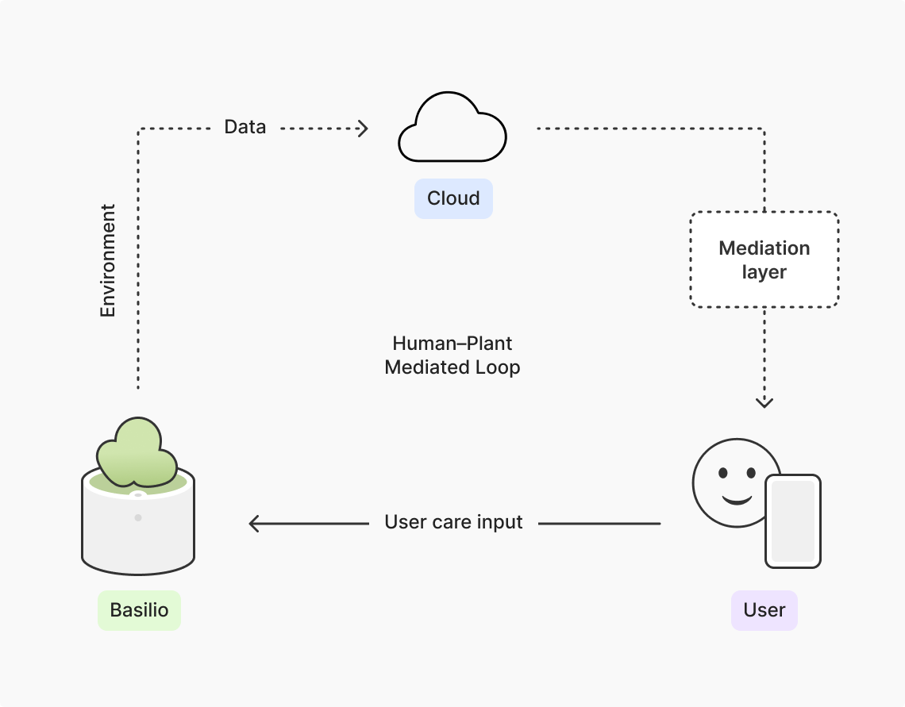

### Basilio Project

This repository contains the files for the Basilio project, including the web interface, experimental data, and implementation resources developed during the study. It supports exploring and analyzing the plant-related data collected throughout the experiment.

#### Who's Basilio?

Basilio is a basil (*Ocimum basilicum*) growing as part of an experiment in animistic design for my master’s degree in Product and Industrial Design at the University of Porto. For 30 days, Basilio kept a journal documenting his environmental conditions and growth throughout the study.

#### Web Interface (Plant Diary)

An interactive web interface that displays the plant’s “journal” and experimental records:

https://veronicaandrd.github.io/basilio/index.html

#### Repository

Full project source code and documentation:

https://github.com/veronicaandrd/basilio

#### Prompt Used in Experiment

Prompt materials used during the Claude (Sonnet 4.6) experiment:

https://github.com/veronicaandrd/basilio/tree/main/prompt

#### Plant Data

Sensor readings and contextual data used to generate experimental records:

https://github.com/veronicaandrd/basilio/tree/main/plantdata

#### ESP32 Implementation

C++ code for the ESP32-based sensing system is included in the repository, enabling data collection from the plant environment.
